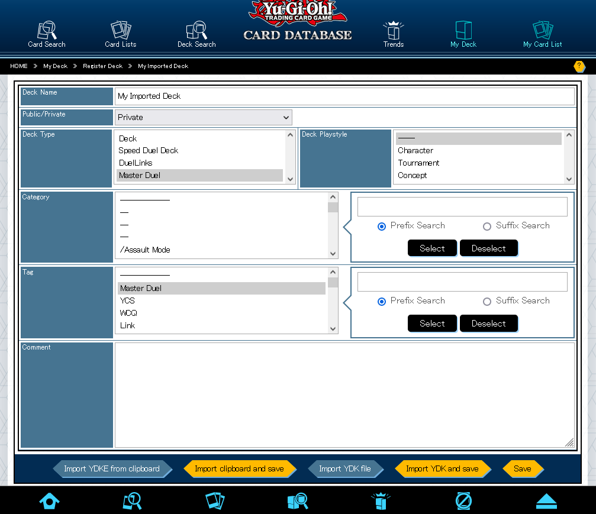
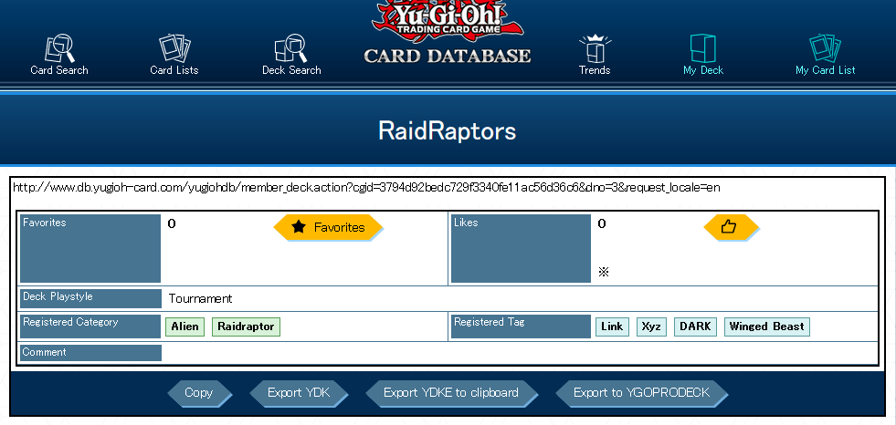
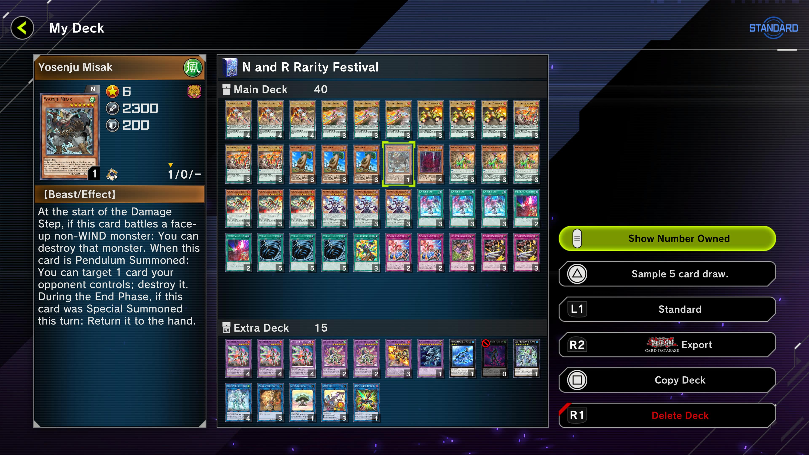
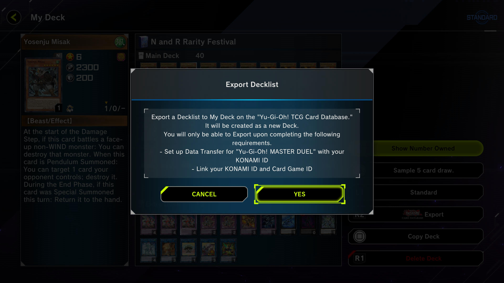
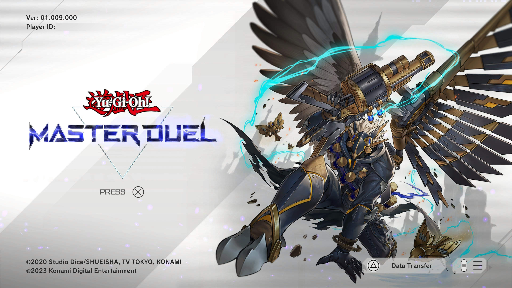
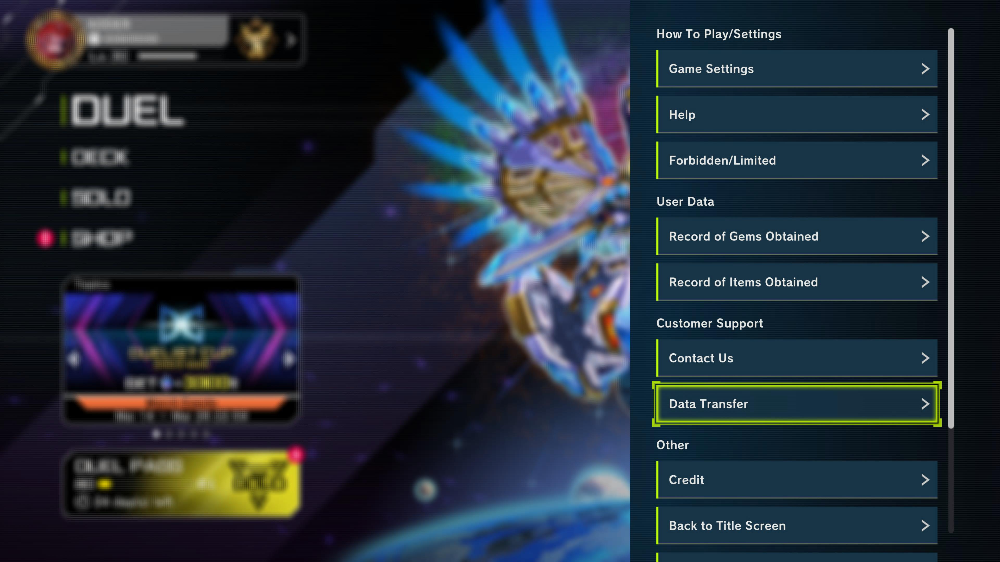

#  Deck transfer for Yu-Gi-Oh! Master Duel and Neuron

<!-- https://extensionworkshop.com/assets/img/documentation/publish/get-the-addon-178x60px.dad84b42.png -->
<!-- The following two images are from https://github.com/gorhill/uBlock -->
[
    
](https://addons.mozilla.org/firefox/addon/deck-transfer-for-master-duel/?utm_source=github&utm_campaign=readme "Get the Firefox add-on")
[
    
](https://chrome.google.com/webstore/detail/lgcpomfflpfipndmldmgblhpbnnfidgk?utm_source=github&utm_campaign=readme "Get the Chromium add-on")

<a href="https://chrome.google.com/webstore/detail/lgcpomfflpfipndmldmgblhpbnnfidgk?utm_source=github&utm_campaign=readme-edge" title="Install for Microsoft Edge from the Chrome Web Store">
    
</a>
&nbsp;
<a href="https://chrome.google.com/webstore/detail/lgcpomfflpfipndmldmgblhpbnnfidgk?utm_source=github&utm_campaign=readme-opera" title="Install for Opera from the Chrome Web Store">
    
</a>
&nbsp;
<a href="#installing-on-safari" title="Install on Safari">
    
</a>
&nbsp;
<a href="#installing-on-android" title="Install on Android">
    
</a>

[Import](#importing) and [export](#exporting) Yu-Gi-Oh! decks from Master Duel and Neuron in YDK format and YDKE URLs via Konami's official card database.
Directly import decks from [YGOPRODECK](https://ygoprodeck.com) and other communities.

Konami's official products have never interoperated with community resources,
but now with this browser extension, you can bring your decks in commonly-used
deck formats directly into the official [Yu-Gi-Oh! Master Duel](https://www.konami.com/yugioh/masterduel/) video game
and [Neuron duel assistant phone app](https://www.konami.com/yugioh/neuron/en/).
You can also [download any deck](#downloading-public-decks) from the official card database, including your
Master Duel and Neuron decks, and share directly to YGOPRODECK.

**Note**: the Opera add-ons listing is deprecated due to slow moderation of extension updates. Opera users should install
from the Chrome Web Store instead like other Chromium browsers to receive the latest features and fixes.

[](https://github.com/DawnbrandBots/deck-transfer-for-master-duel/actions/workflows/lint.yml)
[](https://github.com/DawnbrandBots/deck-transfer-for-master-duel/actions/workflows/test.yml)


## Importing

<details>
    <summary>Video demonstration</summary>

[](https://www.youtube.com/watch?v=ImBRD6fM5Og&utm_source=github "Video demonstration")
</details>

<!-- alternative thumbnail: https://yt-embed.live/embed?v=ImBRD6fM5Og -->

1. Install this extension for your browser of choice with the links above. [Check if it is working on YGOPRODECK](https://ygoprodeck.com/decks/transfer-tool/?utm_source=github&utm_campaign=readme).
1. Link your Master Duel account or Neuron app to a Konami ID. You should be able to export your decks to your official database account in the view deck screen. [See below for further explanation.](#linking-master-duel-to-the-official-database)
1. Log into the [English official card database](https://www.db.yugioh-card.com/yugiohdb/?request_locale=en).
1. Select "My Deck", then add a deck or edit any deck. On the deck editor page, you should see four new buttons injected by this extension:
   
1. Export a deck from [YGOPRODECK](https://ygoprodeck.com) or other sources as a YDKE URL or a YDK file.
1. Use the buttons to import your deck and save.
1. Check in-game for your database decks and copy to your in-game decks! <!-- Screenshot of where the import button is? -->

## Downloading public decks

1. Install this extension for your browser of choice with the links above. [Check if it is working on YGOPRODECK](https://ygoprodeck.com/decks/transfer-tool/?utm_source=github&utm_campaign=readme).
1. Browse ["Deck Search"](https://www.db.yugioh-card.com/yugiohdb/deck_search.action?request_locale=en) on the official database in any language.
1. When you choose a deck, you should see three new buttons injected by this extension: 
1. Use the buttons to export and download the deck.

Note: if you choose a deck containing cards not yet released in the current language region (e.g. OCG-only cards while viewing in English),
those cards will be missing from the display and the exports. In this case, try switching the database language using the
language select is in the top-right corner (e.g. switch to Japanese for OCG-only cards).

## Exporting

1. Install this extension for your browser of choice with the links above. [Check if it is working on YGOPRODECK](https://ygoprodeck.com/decks/transfer-tool/?utm_source=github&utm_campaign=readme).
1. Link your Master Duel account or Neuron app to a Konami ID. [See below for further explanation.](#linking-master-duel-to-the-official-database)
1. Export your Master Duel deck to your official database account in the view deck screen.
   
   
1. Log into the [official card database](https://www.db.yugioh-card.com/yugiohdb/?request_locale=en) in any language.
1. Select "My Deck" and find the exported Master Duel deck. On its page, you should see three new buttons injected by this extension, like with [public decks](#downloading-public-decks).
1. Use the buttons to export and download the deck.

Note: if your deck contains cards not yet released in the current language region (e.g. cards that debut internationally in Master Duel),
those cards will be missing from the display and the exports. In this case, try switching the database language using the
language select is in the top-right corner (e.g. switch to Japanese).

## Linking Master Duel to the official database

Link your Master Duel account to a Konami ID via the data transfer feature.
This is found in the hamburger menu as "Data Transfer", or "Data Transfer" in the title screen.





Follow the instructions to create or log in with your Konami ID.
Your Konami ID must be associated with a Card Game ID.

After data transfer is set up, the card database button in the top-right of the deck screen should show the decks from your official database account.
Furthermore, you should see the export button become available when you view your decks.
Make sure you can log into [Konami's official card database](https://www.db.yugioh-card.com/yugiohdb/?request_locale=en)
and access "My Deck" on the website.

If your Konami ID does not have a Card Game ID, you can try logging into your Konami ID in Neuron.

## Installing on Safari

Compatible with both macOS and iOS, if Userscripts is supported!

1. Install [Userscripts](https://apps.apple.com/app/apple-store/id1463298887) from the App Store.
1. [Enable Userscripts](https://github.com/quoid/userscripts/#usage) (iOS) following its instructions.
1. [Download our userscript](https://dawnbrandbots.github.io/deck-transfer-for-master-duel/storm-access.user.js) to your folder for userscripts.
1. [Check if it is working on YGOPRODECK](https://ygoprodeck.com/decks/transfer-tool/?utm_source=github&utm_campaign=readme).

## Installing on Android

Firefox for Android supports browser extensions. Simply install from [Firefox add-ons](https://addons.mozilla.org/firefox/addon/deck-transfer-for-master-duel/?utm_source=github&utm_campaign=readme) like on desktop.

~~Firefox Beta supports installing extensions beyond the recommended list. If you are interested,
you can follow the same instructions as [Indie Wiki Buddy](https://getindie.wiki/firefox-mobile/?utm_source=dawnbrand)
to set up. You can either create your own collection or use
collection owner [`17816848`](https://addons.mozilla.org/en-CA/firefox/collections/17816848/deck-transfer-for-master-duel/)
and collection name `deck-transfer-for-master-duel`.~~

Unfortunately, most other Android browsers do not support extensions.
Kiwi Browser supports Chrome extensions, but I have not tested or used this browser.

## Privacy

See [PRIVACY.md](./PRIVACY.md).

## Licence

Copyright (C) 2023–2024 Kevin Lu. See [COPYING](./COPYING) for more details.

```
This program is free software: you can redistribute it and/or modify
it under the terms of the GNU General Public License as published by
the Free Software Foundation, either version 3 of the License, or
(at your option) any later version.

This program is distributed in the hope that it will be useful,
but WITHOUT ANY WARRANTY; without even the implied warranty of
MERCHANTABILITY or FITNESS FOR A PARTICULAR PURPOSE.  See the
GNU General Public License for more details.

You should have received a copy of the GNU General Public License
along with this program.  If not, see <https://www.gnu.org/licenses/>.
```

Icon copyright (C) 2023 WolfOfWolves, used with permission.
Icon is NOT covered under the GPL terms. All rights reserved.

## Disclaimer

Yu-Gi-Oh! is (C) 2020 Studio Dice/SHUEISHA, TV TOKYO, KONAMI.
Master Duel and Neuron are produced by Konami Digital Entertainment.
This project is not produced by, endorsed by, supported by, or affiliated with any of them.
